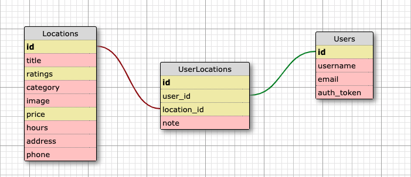

# TwoCents

The _TwoCents-BE_ API represents the back-end component of the Cross Pollination group project, which itself is a component of the fourth module of the Back-End Engineering program at the Turing School of Software and Design. The API uses backend JavaScript technologies (NodeJS and Express) to interface with a front-end built in React Native.

The app can be generally described as a recommendations app, where users can take note of things people in their lives recommend, and get more rich information about each item than they would if it were simply written in a text file. Learning goals for this project include:

* Ultimately, demonstrating knowledge we've gained throughout Turing
* Using an agile process to turn well defined requirements into deployed and production ready software
* Explore and implement new concepts, patterns, or libraries that have not been explicitly taught while at Turing
* Gain more experience using continuous integration tools to build and automate the deployment of features in various environments
* Build applications that execute in development, test, CI, and production environments

The front-end is located at:
https://expo.io/@emilydittmer/two_cents-fe

The back-end (which this documentation relates to) is located at:
https://twocents-be.herokuapp.com/

## Usage

In this app, we focused primarily on recommendations in the form of locations. Therefore, there are tables for users and locations, as well as a joins table for UserLocations. The following endpoints are utilized by the front end to generate the app's experience.

#### User Login
User signs in with Google OAuth
```
  GET /api/v1/users/login
```
##### Parameters
| params | Description |
|--------|-------------|
| p | OAuth Identifier |

##### Response
```
200 OK
Link: <https://twocents-be.herokuapp.com/api/v1/users/login?GOOGLE_ID>
```
```
{
    "id": 2000000,
    "key": <USER_IDENTIFIER>,
    "createdAt": "2019-09-12T03:44:51.643Z",
    "updatedAt": "2019-09-12T03:44:51.643Z",
    "locations": [
        {
          "id": 1,
          "name": "Little Owl Coffee",
          "image": "https://s3-media4.fl.yelpcdn.com/bphoto/L14MabdxIQPvzwNpVzPXPQ/o.jpg",
          "url": "https://www.yelp.com/biz/little-owl-coffee-denver?adjust_creative=SFrK1QyyPZbVwjh2vOWSjw&utm_campaign=yelp_api_v3&utm_medium=api_v3_business_lookup&utm_source=SFrK1QyyPZbVwjh2vOWSjw",
          "phone": "(720) 328-5574",
          "rating": 4.5,
          "reviewCount": 336,
          "categories": [
              "Coffee & Tea",
              "Bakeries"
          ],
          "coordinates": [
              39.7505164957921,
              -104.999718748432
          ],
          "location": [
              "1555 Blake St",
              "Ste 150",
              "Denver, CO 80202"
          ],
          "price": "$$",
          "hours": [
              "0700-1700",
              "0700-1700",
              "0700-1700",
              "0700-1700",
              "0700-1700",
              "0800-1500",
              "0800-1500"
          ],
          "yelpId": "heaStxibj5y6IIuwuXeNSA",
          "createdAt": "2019-09-12T03:44:51.623Z",
          "updatedAt": "2019-09-12T03:44:51.623Z"
        },
        {
          "id": 2,
          "name": "Tacos Tequila Whiskey",
          "image": "https://s3-media2.fl.yelpcdn.com/bphoto/2tCtqQ01nknaOfFEH4W9DA/o.jpg",
          "url": "https://www.yelp.com/biz/tacos-tequila-whiskey-denver-2?adjust_creative=SFrK1QyyPZbVwjh2vOWSjw&utm_campaign=yelp_api_v3&utm_medium=api_v3_business_lookup&utm_source=SFrK1QyyPZbVwjh2vOWSjw",
          "phone": "(720) 475-1337",
          "rating": 4,
          "reviewCount": 1000,
          "categories": [
              "Mexican"
          ],
          "coordinates": [
              39.7403831481934,
              -104.959533691406
          ],
          "location": [
              "1514 York St",
              "Ste 150",
              "Denver, CO 80206"
          ],
          "price": "$$",
          "hours": [
              "1500-2200",
              "1100-2200",
              "1100-2200",
              "1100-2200",
              "1100-2200",
              "1100-2200",
              "1100-2100"
          ],
          "yelpId": "EwiMXeyrGX5IPGJZAXuQdg",
          "createdAt": "2019-09-12T03:44:51.623Z",
          "updatedAt": "2019-09-12T03:44:51.623Z"
        }
    ]
}
```

---
#### User Sign Up
User signs up with Google OAuth
```
  GET /api/v1/users/signup
```
##### Parameters
| params | Description |
|--------|-------------|
| p | OAuth Identifier |

##### Response
```
200 OK
Link: <https://twocents-be.herokuapp.com/api/v1/users/signup?GOOGLE_ID>
```

```
{
    "id": 2000000,
    "key": <USER_IDENTIFIER>,
    "createdAt": "2019-09-12T03:44:51.643Z",
    "updatedAt": "2019-09-12T03:44:51.643Z",
    "locations": []
}
```
---
#### Search by User Recommendations
User views their collection of recommendations

```
GET /api/v1/users/recommendations/ENCRYPTED_USER_KEY
```
##### Parameters
| params | Description |
|--------|-------------|
|   id   | encrypted user key |

Note: keys encrypted using Google OAuth ID

##### Response
```
200 OK
Link: <https://twocents-be.herokuapp.com/api/v1/users/recommendations/>
```
```
{
    "id": 1,
    "key": ENCRYPTED_USER_KEY,
    "createdAt": "2019-09-12T03:44:51.643Z",
    "updatedAt": "2019-09-12T03:44:51.643Z",
    "locations": [
        {
            "id": 1,
            "name": "Little Owl Coffee",
            "image": "https://s3-media4.fl.yelpcdn.com/bphoto/L14MabdxIQPvzwNpVzPXPQ/o.jpg",
            "url": "https://www.yelp.com/biz/little-owl-coffee-denver?adjust_creative=SFrK1QyyPZbVwjh2vOWSjw&utm_campaign=yelp_api_v3&utm_medium=api_v3_business_lookup&utm_source=SFrK1QyyPZbVwjh2vOWSjw",
            "phone": "(720) 328-5574",
            "rating": 4.5,
            "reviewCount": 336,
            "categories": [
                "Coffee & Tea",
                "Bakeries"
            ],
            "coordinates": [
                39.7505164957921,
                -104.999718748432
            ],
            "location": [
                "1555 Blake St",
                "Ste 150",
                "Denver, CO 80202"
            ],
            "price": "$$",
            "hours": [
                "0700-1700",
                "0700-1700",
                "0700-1700",
                "0700-1700",
                "0700-1700",
                "0800-1500",
                "0800-1500"
            ],
            "yelpId": "heaStxibj5y6IIuwuXeNSA",
            "createdAt": "2019-09-12T03:44:51.623Z",
            "updatedAt": "2019-09-12T03:44:51.623Z"
        },
        {
            "id": 2,
            "name": "Tacos Tequila Whiskey",
            "image": "https://s3-media2.fl.yelpcdn.com/bphoto/2tCtqQ01nknaOfFEH4W9DA/o.jpg",
            "url": "https://www.yelp.com/biz/tacos-tequila-whiskey-denver-2?adjust_creative=SFrK1QyyPZbVwjh2vOWSjw&utm_campaign=yelp_api_v3&utm_medium=api_v3_business_lookup&utm_source=SFrK1QyyPZbVwjh2vOWSjw",
            "phone": "(720) 475-1337",
            "rating": 4,
            "reviewCount": 1000,
            "categories": [
                "Mexican"
            ],
            "coordinates": [
                39.7403831481934,
                -104.959533691406
            ],
            "location": [
                "1514 York St",
                "Ste 150",
                "Denver, CO 80206"
            ],
            "price": "$$",
            "hours": [
                "1500-2200",
                "1100-2200",
                "1100-2200",
                "1100-2200",
                "1100-2200",
                "1100-2200",
                "1100-2100"
            ],
            "yelpId": "EwiMXeyrGX5IPGJZAXuQdg",
            "createdAt": "2019-09-12T03:44:51.623Z",
            "updatedAt": "2019-09-12T03:44:51.623Z"
        }
    ]
}
```
---

#### Create User Recommendations
User adds a recommendation
```
  POST /api/v1/users/recommendations/ENCRYPTED_USER_KEY?yelpId=YELP_ID
```
##### Parameters
| params | Description |
|--------|-------------|
|   id   | encrypted user key |
| yelpID |   yelp id   |

Note: keys encrypted using Google OAuth ID

##### Response
```
201 Created
Link: <https://twocents-be.herokuapp.com/api/v1/users/recommendations/$ENCRYPTED_USER_KEY?yelpId=YELP_ID>
```
```
{
  "id": 1236,
  "userId": 105,
  "locationId": 456,
  "notes": "",
  "updatedAt": "2019-09-12T04:51:50.285Z",
  "createdAt": "2019-09-12T04:51:50.285Z"
}
```
---

#### Delete User Recommendations
User removes a recommendation
```
  DELETE /api/v1/users/recommendations/ENCRYPTED_USER_KEY?yelpId=YELP_ID
```
##### Parameters
| params | Description |
|--------|-------------|
|   id   | encrypted user key |
| yelpID |   yelp id   |

Note: keys encrypted using Google OAuth ID

##### Response
```
204 No Content
Link: <https://twocents-be.herokuapp.com/api/v1/users/recommendations/ENCRYPTED_USER_KEY?yelpId=YELP_ID>
```
---

#### Search Locations by Keyword Term
Get a collection of recommendations based off of keyword term search.
```
  GET /api/v1/search/recommendations_search
```
##### Parameters
| params | Description |
|--------|-------------|
|   q    | search term |

Note: example of a search term would be coffee
##### Response
```
200 OK
Link: <https://twocents-be.herokuapp.com/api/v1/search/recommendations_search?q=SEARCH_TERM>
```
```
[
    {
        "id": 1,
        "name": "Little Owl Coffee"
    },
    {
        "id": 5,
        "name": "Crema Coffee House"
    },
    {
        "id": 6,
        "name": "Novo Coffee"
    },
    {
        "id": 8,
        "name": "Serendipity Coffee Bar"
    },
    {
        "id": 9,
        "name": "Sapor Coffee & Concepts"
    },
    {
        "id": 2,
        "name": "Fluid Coffee Bar"
    },
    {
        "id": 11,
        "name": "Blue Sparrow Coffee"
    }
]
```
---

#### Search Yelp Locations by Keyword and Location
Search uses the Yelp API to find locations not yet in the production database.
```
  GET /api/v1/search/yelp_search?term=KEYWORD&location=ADDRESS

  GET /api/v1/search/yelp_search?term=KEYWORD&latitude=COORDINATE&longitude=COORDINATE
```
##### Parameters
| params | Description |
|--------|-------------|
|  term  | search term |
|location|   semantic address  |
|latitude|   latitude coordinate  |
|longitude|   longitude coordinate  |

Note: an example of a search term would be "coffee", and an example of location would be "denver,co", "80202", or "1331 17th St Denver, CO". An example of coordinates are would be "27.3805092,33.6318609".
​
##### Response
```
200 OK
Link: <https://twocents-be.herokuapp.com/api/v1/search/yelp_search?term=coffee&location=80202>
Link: <https://twocents-be.herokuapp.com/api/v1/search/yelp_search?term=coffee&latitude=39.7508006&longitude=-104.9965947>
```
```
[
    {
        "name": "Little Owl Coffee",
        "image": "https://s3-media4.fl.yelpcdn.com/bphoto/L14MabdxIQPvzwNpVzPXPQ/o.jpg",
        "url": "https://www.yelp.com/biz/little-owl-coffee-denver?adjust_creative=SFrK1QyyPZbVwjh2vOWSjw&utm_campaign=yelp_api_v3&utm_medium=api_v3_business_search&utm_source=SFrK1QyyPZbVwjh2vOWSjw",
        "phone": "(720) 328-5574",
        "rating": 4.5,
        "reviewCount": 337,
        "categories": [
            "Coffee & Tea",
            "Bakeries"
        ],
        "coordinates": [
            39.7505164957921,
            -104.999718748432
        ],
        "location": [
            "1555 Blake St",
            "Ste 150",
            "Denver, CO 80202"
        ],
        "price": "$$",
        "yelpId": "heaStxibj5y6IIuwuXeNSA"
    },
    {
        "name": "Serendipity Coffee Bar",
        "image": "https://s3-media1.fl.yelpcdn.com/bphoto/lbgG-QNJGCNinzAiUBYUlw/o.jpg",
        "url": "https://www.yelp.com/biz/serendipity-coffee-bar-denver?adjust_creative=SFrK1QyyPZbVwjh2vOWSjw&utm_campaign=yelp_api_v3&utm_medium=api_v3_business_search&utm_source=SFrK1QyyPZbVwjh2vOWSjw",
        "phone": "(303) 405-6780",
        "rating": 4.5,
        "reviewCount": 9,
        "categories": [
            "Coffee & Tea",
            "Breakfast & Brunch",
            "Vegetarian"
        ],
        "coordinates": [
            39.751068,
            -105.0016899
        ],
        "location": [
            "1536 Wynkoop St",
            "Denver, CO 80202"
        ],
        "price": "$",
        "yelpId": "c9tsOxhiwFRtFWtY_Xf_7Q"
    }
]
```
---

#### Search Single Yelp Location by Business/Yelp ID
Search uses the Yelp API to find a single location not yet in the production database.
```
  GET /api/v1/search/yelp_business?yelpId=YELP_ID
```
##### Parameters
| params | Description |
|--------|-------------|
| yelpId |   yelp id   |


##### Response
```
200 OK
Link: <https://twocents-be.herokuapp.com/api/v1/search/yelp_business?yelpId=wmGPi9TKAkWbiWzIhE2U9g>
```
```
{
    "name": "Highland Tavern",
    "image": "https://s3-media4.fl.yelpcdn.com/bphoto/wUTo1kzYprBZekjQb3rDxQ/o.jpg",
    "url": "https://www.yelp.com/biz/highland-tavern-denver?adjust_creative=SFrK1QyyPZbVwjh2vOWSjw&utm_campaign=yelp_api_v3&utm_medium=api_v3_business_lookup&utm_source=SFrK1QyyPZbVwjh2vOWSjw",
    "phone": "(303) 433-1990",
    "rating": 4,
    "reviewCount": 524,
    "categories": [
        "Bars",
        "American (Traditional)"
    ],
    "coordinates": [
        39.7645908878767,
        -105.00402038862
    ],
    "location": [
        "3400 Navajo St",
        "Denver, CO 80211"
    ],
    "hours": [
        "1100-0200",
        "1100-0200",
        "1100-0200",
        "1100-0200",
        "1100-0200",
        "1000-0200",
        "1000-0200"
    ],
    "price": "$$",
    "yelpId": "wmGPi9TKAkWbiWzIhE2U9g"
}
```
---
## Database

The database uses PostgreSQL, and its schema is shown below.



## Tech Stack

This application uses:
* Node version 10.16.2
* Express version 4.16.4
* Sequelize version 5.15.0
* Jest version 24.9.0
* DOTENV version 8.1.0
* PostgreSQL version 7.12.1

## Initial Set Up and Testing

Feel free to clone this API's repository. Once cloned, run the following commands to install the necessary packages and set up the application.

`npm install`\
`npx sequelize db:create`\
`npx sequelize db:migrate`\
`npx sequelize db:seed:all`

Jest was used for testing for this application. To run the test suite, run `npm test`.

## Contributors

This was a group project. The four contributors and their GitHub account information are shown below.

Kyle Cornelissen \
https://github.com/kylecornelissen

Emily Dittmer \
https://github.com/emilydittmer

Nathan Froehlich \
https://github.com/Nathan-Froeh

Martin Mercer \
https://github.com/m-mrcr

## How to Contribute

If you would desire to contribute to the project, fork the project from the
master branch. You may then make changes you deem appropriate and
submit a pull request. Please provide a detailed explanation of what feature, problem, or bug fix you are presenting.
